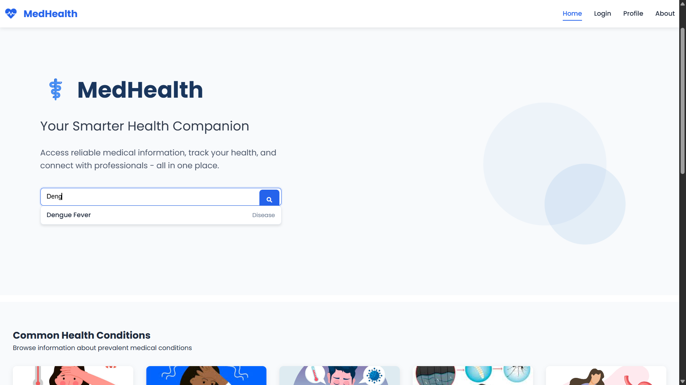
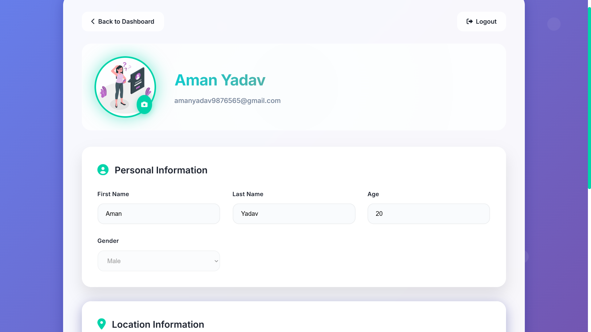
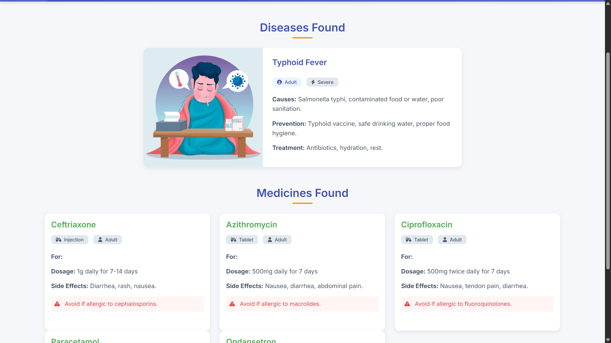
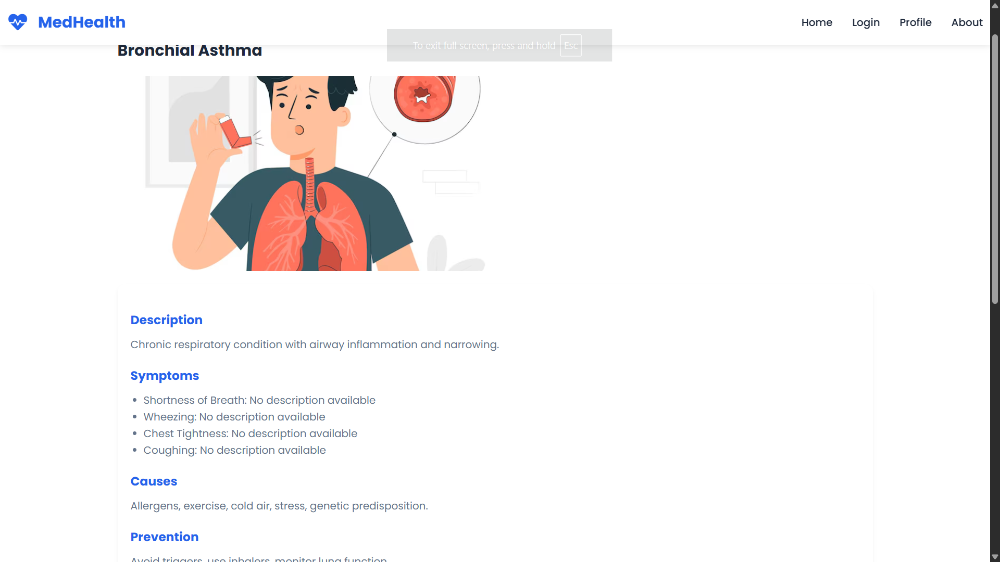
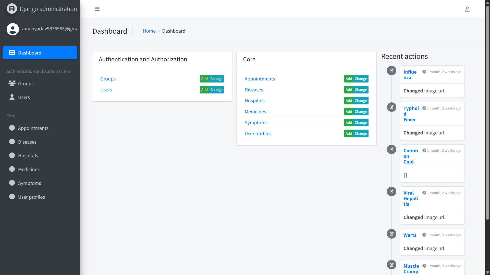

# 🏥 MedHealth – A Smart Health Assistant (Mini Project)

**MedHealth** is a smart health assistant web application built using Django and MySQL. It allows users to search for diseases, view associated symptoms and medicines, and manage their health profile. Authentication is securely handled using **Firebase**, while data is managed with a **MySQL database**. The app includes a modern **admin panel** using Jazzmin.

This project is built as an academic mini project and demonstrates full-stack capabilities, authentication, and admin-level content control.

---

## 🚀 Features

- 🔍 **Search System** – Search for diseases, symptoms, and medicines using intelligent queries.
- 🧠 **Smart Autocomplete** – Real-time suggestions while typing (disease, medicine, symptom).
- 🧑‍⚕️ **User Profiles** – Users can create/update their profile with name, email, and existing diseases.
- 💊 **Medicine Details** – Each medicine includes form type (tablet, syrup, etc.) and related diseases.
- 📚 **Disease Information** – Disease details include symptoms and recommended medicines.
- 🔐 **Authentication** – Integrated with **Firebase Authentication**.
- 🛠️ **Admin Dashboard** – Powered by **Jazzmin** for easy backend management.
- 📋 **All Conditions Listing** – Explore a full list of diseases via the "All Conditions" page.

---

## ⚙️ Tech Stack

| Layer             | Technology                      |
|------------------|----------------------------------|
| 🖼️ Frontend       | HTML5, CSS3, Bootstrap (optional) |
| 🧠 Backend        | Django 5.2 (Python)              |
| 🗄️ Database       | MySQL                            |
| 🔐 Auth           | Firebase Authentication          |
| 🛠 Admin Panel    | Jazzmin (Custom Django Admin)    |

---

## 🏗️ Project Structure

medhealth/
├── core/ # Django app for logic
│ ├── models.py # Disease, Medicine, Profile, etc.
│ ├── views.py # Views for profile, search, save
│ ├── templates/core/ # HTML templates
│ └── static/ # CSS, JS, icons
├── medhealth/ # Django project settings
│ └── settings.py # Custom settings (MySQL, Firebase, etc.)
├── media/ # Uploaded profile images
├── db.sqlite3 (not used) # Optional fallback
├── manage.py # Django CLI
└── README.md # Project documentation

## 📸 Screenshots

### 🏠 Home Page  


### 👤 Profile Form  


### 🔍 Search Results  


### 📖 Disease Detail  


### 🛠️ Admin Panel  



## 🛠️ Installation Guide

### 1. Clone the Repository

```bash
git clone https://github.com/yourusername/medhealth.git
cd medhealth
```
## Create Virtual Environment
# For Windows
```bash
python -m venv venv
venv\Scripts\activate
```
# For Mac/Linux
```
python3 -m venv venv
source venv/bin/activate
```
#Install Dependencies
```
pip install -r requirements.txt
```

# SQL Setup
```
DATABASES = {
    'default': {
        'ENGINE': 'django.db.backends.mysql',
        'NAME': 'medhealth_db',
        'USER': 'root',
        'PASSWORD': 'your_password',
        'HOST': 'localhost',
        'PORT': '3306',
    }
}
```
## 🔑 Firebase Service Account Setup

1. Ask the admin for the `firebase-key.json` file.
2. Place it in the project root (same directory as `manage.py`).
3. Do not rename the file and do NOT commit it to GitHub.

# To Start and Run the Server 
```
python manage.py makemigrations
python manage.py migrate
python manage.py runserver
```

